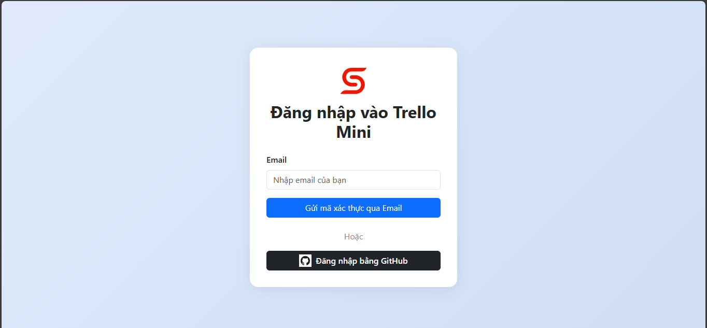
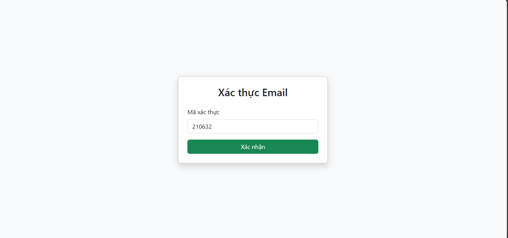
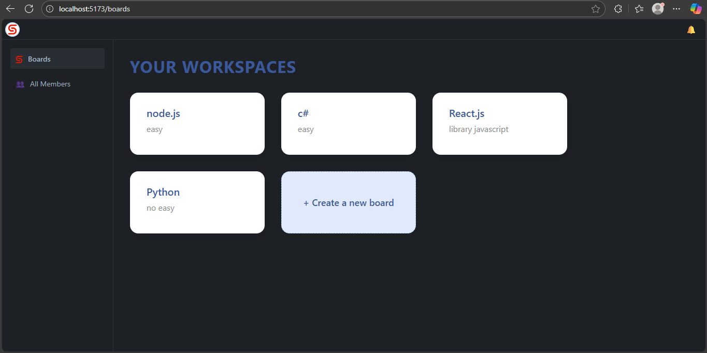
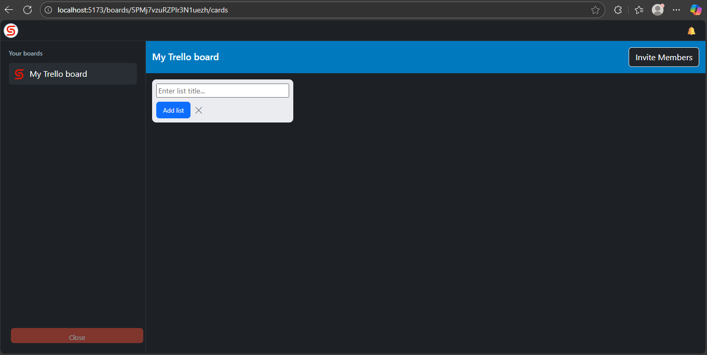
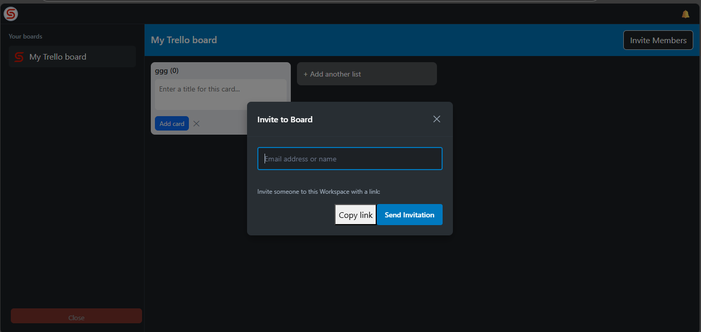
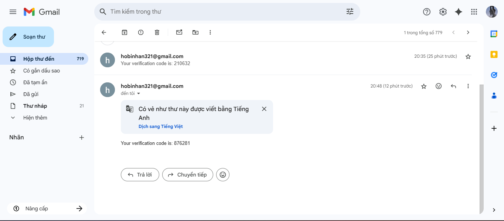

# 🚀 Mini Trello App

---

## 📞 **Support & Contact**

- **Developer:** anbi
- **Email:** hobinhan@gmail.com
- **GitHub:** https://github.com/an612004/Mini-Trello-app
- **Documentation:** https://docs.mini-trello.com

## 📸 Ảnh chụp màn hình (Screenshots)

Dưới đây là các giao diện chính của ứng dụng:

### Authentication & Giao diện Chính

| Tính năng                   |                Ảnh chụp màn hình                 |
| :-------------------------- | :----------------------------------------------: |
| **Đăng nhập**               |               |
| **Xác thực Mã (OTP/Token)** |                 |
| **Quản lý Boards**          |  |
| **Tạo Board mới**           |           |
| **Chi tiết Card**           |                     |

### Quản lý Thành viên

| Tính năng             |               Ảnh chụp màn hình                |
| :-------------------- | :--------------------------------------------: |
| **Mời Thành viên**    |            |
| **Gửi Email Lời mời** |  |

---

## 🛠️ Hướng dẫn Khởi chạy Dự án

Để chạy ứng dụng trên môi trường cục bộ, làm theo các bước sau:

1.  **Mở Terminal** và điều hướng đến thư mục dự án.

2.  **Khởi động Backend:**

    ```bash
    cd backend
    npm install  # Cài đặt các dependencies (nếu chưa chạy lần nào)
    npm run dev  # Chạy server
    ```

3.  **Khởi động Frontend** (mở Terminal mới):
    ```bash
    cd frontend
    npm install  # Cài đặt các dependencies (nếu chưa chạy lần nào)
    npm run dev  # Chạy ứng dụng client
    ```
    Ứng dụng sẽ khả dụng trên trình duyệt của bạn (thường là `http://localhost:3000`).

---

## ⚙️ Thiết lập Môi trường

Dự án yêu cầu một file cấu hình `.env` để thiết lập các biến môi trường quan trọng (ví dụ: chuỗi kết nối Database, khóa bảo mật JWT, thông tin Email Server, v.v.).

- **File cấu hình:**
  ```
  .env
  ```

---

## 🎯 Quy trình Phát triển

1.  **Phân tích Yêu cầu và API:** Xác định các tính năng cốt lõi, luồng dữ liệu và thiết kế cấu trúc API theo chuẩn RESTful.
2.  **Thiết lập Môi trường:** Tạo và cấu hình các file `.env` cần thiết cho Backend và Frontend.

---

## 🌐 Danh sách API Endpoints

Các API được tổ chức và quản lý theo từng nhóm chức năng rõ ràng.

### 🔑 Authentication APIs (`/auth`)

| Phương thức | Endpoint       | Mô tả                                 |
| :---------- | :------------- | :------------------------------------ |
| `POST`      | `/auth/signup` | Đăng ký tài khoản người dùng mới.     |
| `POST`      | `/auth/signin` | Đăng nhập và nhận **Token** xác thực. |

---

### 🗄️ Repository APIs (`/repositories`)

| Phương thức | Endpoint                                  | Mô tả                                                       |
| :---------- | :---------------------------------------- | :---------------------------------------------------------- |
| `GET`       | `/repositories`                           | Lấy thông tin các repository đã được liên kết.              |
| `GET`       | `/repositories/:repositoryId/github-info` | Lấy thông tin chi tiết từ GitHub của một repository cụ thể. |

---

### 📋 Board APIs (`/boards`)

| Phương thức | Endpoint                            | Mô tả                                              |
| :---------- | :---------------------------------- | :------------------------------------------------- |
| `POST`      | `/boards`                           | **Tạo** Board mới.                                 |
| `GET`       | `/boards`                           | Lấy **tất cả** Boards mà người dùng là thành viên. |
| `GET`       | `/boards/:boardId`                  | Lấy Board theo **ID**.                             |
| `PUT`       | `/boards/:boardId`                  | **Cập nhật** thông tin Board.                      |
| `DELETE`    | `/boards/:boardId`                  | **Xóa** Board.                                     |
| `POST`      | `/boards/:boardId/invite`           | **Mời** người dùng vào Board.                      |
| `POST`      | `/boards/:boardId/invite/:inviteId` | **Chấp nhận** lời mời Board.                       |

---

### 📄 Card APIs (`/boards/:boardId/cards`)

| Phương thức | Endpoint                                       | Mô tả                             |
| :---------- | :--------------------------------------------- | :-------------------------------- |
| `GET`       | `/boards/:boardId/cards`                       | Lấy **tất cả Cards** trong Board. |
| `POST`      | `/boards/:boardId/cards`                       | **Tạo** Card mới.                 |
| `GET`       | `/boards/:boardId/cards/:cardId`               | Lấy Card theo **ID**.             |
| `PUT`       | `/boards/:boardId/cards/:cardId`               | **Cập nhật** Card.                |
| `DELETE`    | `/boards/:boardId/cards/:cardId`               | **Xóa** Card.                     |
| `GET`       | `/boards/:boardId/cards/user/:userId`          | Lấy Cards được giao cho một User. |
| `POST`      | `/boards/:boardId/cards/invite`                | **Mời** người dùng vào Card.      |
| `POST`      | `/boards/:boardId/cards/:cardId/invite/accept` | **Chấp nhận** lời mời Card.       |

---

### ✅ Task APIs (`/boards/:boardId/cards/:cardId/tasks`)

| Phương thức | Endpoint                                                        | Mô tả                                  |
| :---------- | :-------------------------------------------------------------- | :------------------------------------- |
| `GET`       | `/boards/:boardId/cards/:cardId/tasks`                          | Lấy **tất cả Tasks** trong Card.       |
| `POST`      | `/boards/:boardId/cards/:cardId/tasks`                          | **Tạo** Task mới.                      |
| `GET`       | `/boards/:boardId/cards/:cardId/tasks/:taskId`                  | Lấy Task theo **ID**.                  |
| `PUT`       | `/boards/:boardId/cards/:cardId/tasks/:taskId`                  | **Cập nhật** Task.                     |
| `DELETE`    | `/boards/:boardId/cards/:cardId/tasks/:taskId`                  | **Xóa** Task.                          |
| `POST`      | `/boards/:boardId/cards/:cardId/tasks/:taskId/assign`           | **Gán** thành viên cho Task.           |
| `GET`       | `/boards/:boardId/cards/:cardId/tasks/:taskId/assign`           | Lấy danh sách thành viên **được gán**. |
| `DELETE`    | `/boards/:boardId/cards/:cardId/tasks/:taskId/assign/:memberId` | **Xóa** thành viên khỏi Task.          |

---

### 🔗 GitHub Integration APIs

Các API này được lồng ghép trong Task để quản lý các liên kết GitHub.

| Phương thức | Endpoint                                             | Mô tả                                      |
| :---------- | :--------------------------------------------------- | :----------------------------------------- |
| `POST`      | `.../tasks/:taskId/github-attach`                    | **Đính kèm** GitHub repository vào Task.   |
| `GET`       | `.../tasks/:taskId/github-attachments`               | Lấy danh sách GitHub attachments của Task. |
| `DELETE`    | `.../tasks/:taskId/github-attachments/:attachmentId` | **Xóa** GitHub attachment.                 |
